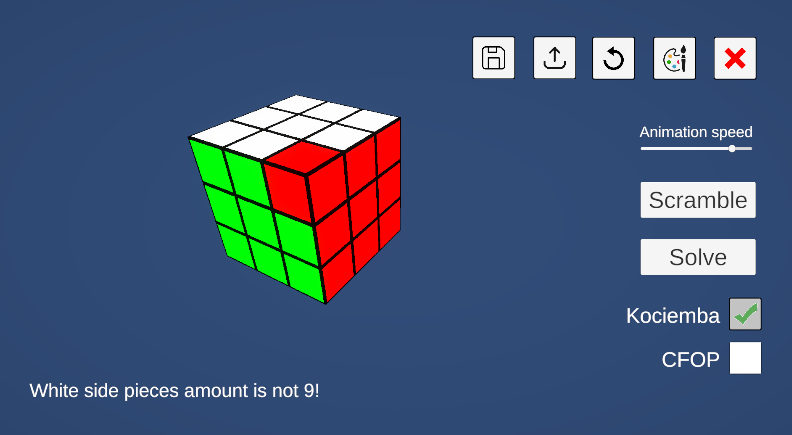

# Rubik's cube solver

Made with [Unity 6000.0.26f1](https://unity.com/releases/editor/whats-new/6000.0.26).

The program allows you to scramble cube manually, automatically, or edit cubies directly.

By pressing shift and rotate - the side does double turn.

Unsolvable positions are detected:

There are 2 ways to solve cube:
 * Kociemba two-phase algorithm - solution of 20 moves on average
 * CFOP - solution of 63 moves on average

You also can save and load cube states from file.

In editor you can run tests on various algorithms (in menu bar: Tools -> Algorithms tests):
 * algorithm optimization ([R U U' R'] => [] and others)
 * algorithm normalization ([RUR'U'] => [R U R' U'])
 * algorithm validation
 * solve random cube states

The actual code of tests is inside of `.\Assets\Scripts\Algorithms\AlgorithmsTests.cs`
